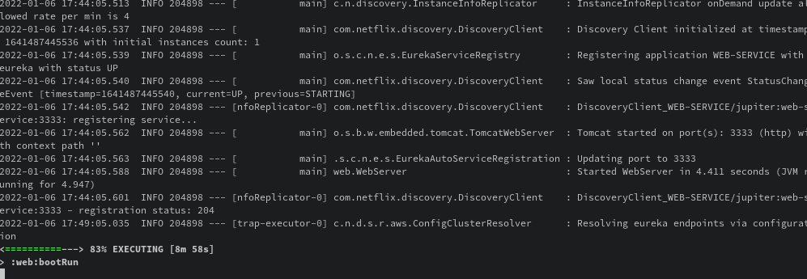

# Lab6-microservices

Firstly, we have to run registration, accounts and web services. The registration service must be run before the other services. To achieve that, we have to run (in different terminals) the following 3 commands:

```bash
./gradlew :registration:bootRun
```

```bash
./gradlew :accounts:bootRun
```

```bash
./gradlew :web:bootRun
```

After running registration, we can run accounts and web, we get the following screencaptures:

This first one about registration service:


And this second one about web service:



At this moment, we can check that accounts and web services are registered in Eureka. We can check it in `https://localhost:1111`:


After that, we are going to register a new account service but using the port 4444. To do we have to change in `accounts/src/main/resources/application.yml` the line 7 and write 4444 instead of 2222. Like the following screenshot:


Now we can run the following command again:

```bash
./gradlew :accounts:bootRun
```

And we have another accounts service running:


To check it we can check it again in `https://localhost:1111`:


If we kill the first accounts service, it dessapears from the Euroka dashboard:


Instead of that, the second accounts service and the web service keep running.

We can see that they keep working in the following screenshot:


It keep running because Eureka acts as a mediator between the web service and the accounts service, Eureka detects that the first service is dead and don't make any problem with that. The web server ask for the `ACCOUNTS-SERVICE` and Eureka return the route to the not dead service.